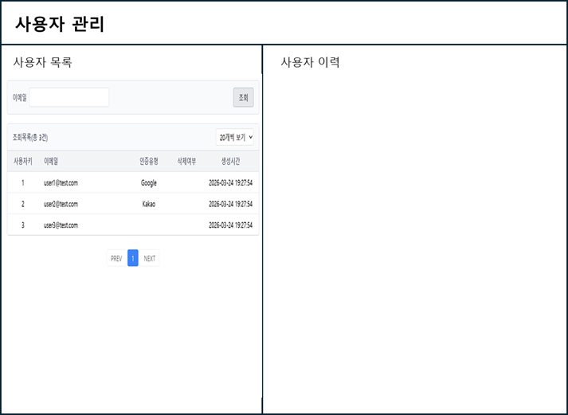
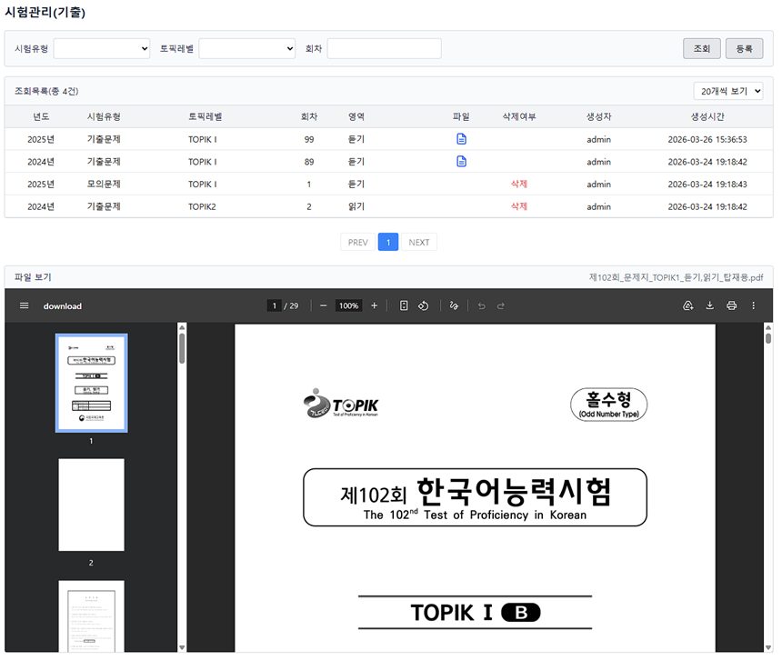
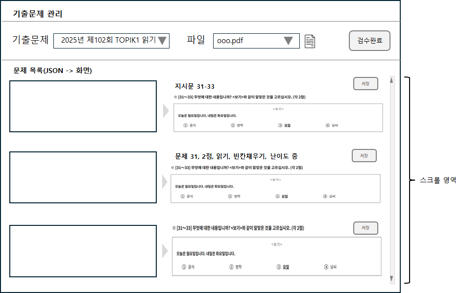
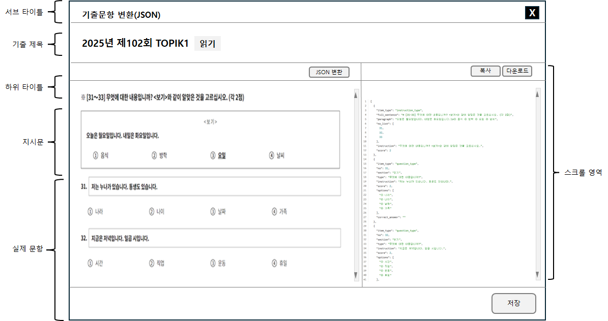
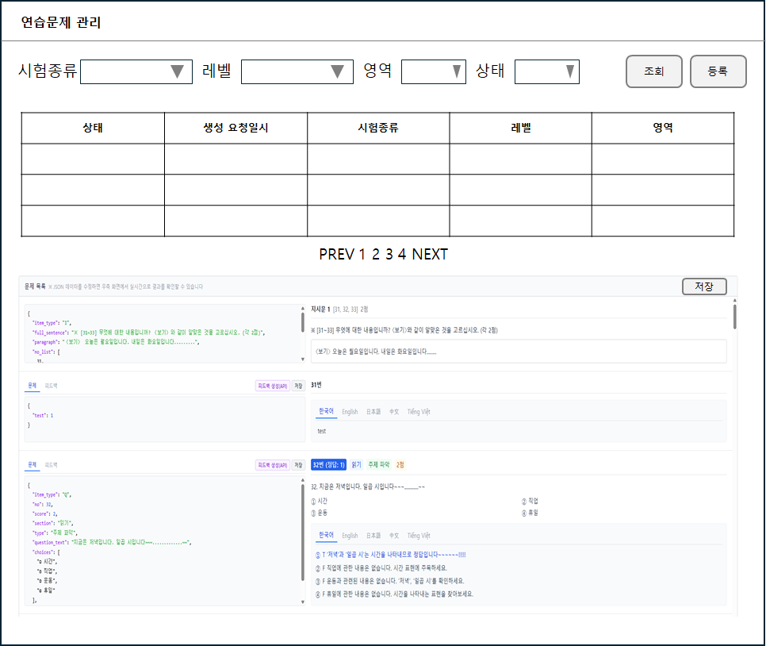
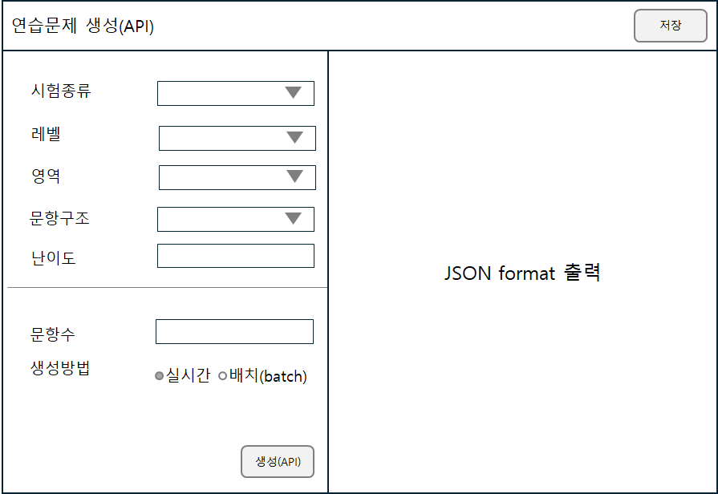

# 관리자 웹 개발 지침

> 루트 [CLAUDE.md](../CLAUDE.md)의 공통 제약사항을 반드시 준수할 것

## 기술 스택

- **Framework**: Vue.js 3 (Composition API)
- **빌드**: Vite
- **상태 관리**: Pinia
- **라우팅**: Vue Router 4
- **스타일**: Tailwind CSS
- **UI 언어**: 한국어 고정 (다국어 미적용, vue-i18n 미사용)

## 디렉토리 구조

```
admin-web/
├── src/
│   ├── main.js           # 앱 진입점 (Vue, Pinia, Router 초기화)
│   ├── App.vue           # 루트 컴포넌트
│   ├── router/           # Vue Router 라우트 정의
│   │   └── index.js
│   ├── stores/           # Pinia 스토어 (도메인별 분리)
│   ├── views/            # 페이지 단위 컴포넌트
│   ├── components/       # 재사용 가능한 공통 컴포넌트
│   │   ├── common/       # SearchBar, DataTable, Pagination, FormModal, ConfirmDialog, AppToast
│   │   ├── layout/       # AdminLayout, AppHeader, AppSidebar
│   │   ├── examList/     # ExamListFormModal, FilePopupMenu, FileUploadZone, PdfViewer
│   │   ├── examQuestion/ # ExamInstructionCard, ExamQuestionCard, JsonEditorPanel, AiProviderDropdown
│   │   ├── code/         # CodeFormModal
│   │   └── groupCode/    # GroupCodeFormModal
│   ├── composables/      # Vue 컴포저블 (useToast 등)
│   └── api/              # API 호출 모듈
├── eslint.config.js      # ESLint v9 flat config
├── index.html
├── package.json
├── vite.config.js
├── tailwind.config.js
└── CLAUDE.md
```

## 개발 서버 실행

```bash
cd admin-web
corepack pnpm install
corepack pnpm run dev
```

## 코드 품질

```bash
corepack pnpm run lint        # ESLint 검사
corepack pnpm run lint:fix    # ESLint 자동 수정
corepack pnpm run format      # Prettier 포매팅
```

## 코딩 규칙

### Vue 컴포넌트

- **Composition API + `<script setup>`** 문법을 사용한다.
- 컴포넌트 파일 상단에 한글 주석으로 컴포넌트의 역할을 설명한다.
- 단일 파일 컴포넌트(SFC) 순서: `<script setup>` → `<template>` → `<style>`

### 관리자 전용 규칙

- 모든 관리자 페이지는 인증 가드(navigation guard)를 통해 접근 제어한다.
- 목록 페이지는 테이블 형태로 구성하며, 페이징/검색/정렬을 지원한다.
- 등록/수정 폼은 입력 검증 후 API를 호출한다.
- 삭제 작업은 반드시 확인 다이얼로그를 표시한 후 실행한다.
- **팝업(FormModal)에서 삭제 처리는 삭제 버튼으로 통일한다.** 폼 내에 삭제여부(del_yn) 셀렉트박스를 두지 않는다. 수정 모드에서 `showDelete` prop으로 삭제 버튼을 표시하고, ConfirmDialog 확인 후 삭제 API를 호출한다.
- 날짜/시간 표시 포맷: `YYYY-MM-DD HH24:MI:SS` (예: 2026-03-17 15:20:04)
- 조회 테이블 상단 바: 좌측에 `조회목록(총 N건)` 표시, 우측에 페이지당 행 수 선택 selectbox (10개, 20개, 50개, 기본 20개).
- 삭제여부(del_yn) 컬럼 표시 규칙: `N` → 공백, `Y` → 빨간색 폰트로 '삭제' 표시.
- 테이블 컬럼 헤더 클릭 시 오름차순/내림차순 정렬 (클라이언트 사이드). `sortable: false`로 특정 컬럼 정렬 비활성화 가능.
- API 에러 발생 시 서버 응답의 `detail` 메시지를 alert 팝업으로 표시한다 (예: "이미 존재하는 그룹코드입니다."). 공통 Axios 인터셉터(`api/index.js`)에서 `error.detail`로 추출.

### 공통 화면 Layout

* 전체 레이아웃: 헤더(상단) + 사이드바(좌측, 다크 테마) + 콘텐츠(우측)
  * 사이드바: 접기/펼치기 토글 지원 (헤더 ☰ 버튼). 접힘 시 아이콘만, 펼침 시 아이콘+텍스트.
* 공통 조회 레이아웃 : TPK_MVP/admin-web/layout_image/common_search_layout.png
  * 서브 타이틀, 조회 조건(SearchBar), 테이블 리스트(DataTable), 페이징 바(Pagination)로 구성
  * SearchBar에 `hide-register` prop으로 등록 버튼 숨김 가능 (조회 전용 화면에서 사용)
* 공통 팝업 레이아웃 : TPK_MVP/admin-web/layout_image/common_popup_layout.png

노트 : 화면의 정의되어 있지 않는 경우 그룹코드 레이아웃과 유사항 패턴으로 생성한다.

### 화면

- 사용자 관리

  - 사용자 목록과 사용자 이력으로 구분된 형태
    
  - 사용자 목록 : 현재 구현된 부분을 그대로 적용(생성시간 컬럼은 visiable=false)
  - 사용자 이력 : <일단 비워둘 것>
- 시험관리(기출)

  - 화면 예시
    
  - 등록/수정 팝업 하단에 기출문제(PDF) 파일 업로드 영역
    - 시험유형이 '기출문제'(code=1)인 경우에만 업로드 활성화 (기본 비활성)
    - 다중 파일 업로드 + 드래그앤드롭 지원
    - 등록 모드: 파일을 pendingFiles에 보관 → 저장 시 시험정보 저장 후 순차 업로드
    - 수정 모드: 즉시 업로드 + 기존 파일 목록 표시/삭제
    - 파일 저장 테이블: `tb_exam_file` (FK: `tb_exam_list.exam_key`)
    - 비-PDF 파일 업로드 시 에러: '기출문제 파일 형식이 PDF가 아닌 것 같으니 확인 바랍니다.'
  - 조회 목록에 '파일' 컬럼: PDF 업로드 여부를 파일 아이콘(SVG) / 공백으로 표시
  - 파일 아이콘 클릭 시 팝업 메뉴로 파일 목록 표시 → 선택 시 하단 '파일 보기' 영역에 PDF 인라인 렌더링
  - 다른 행 클릭 시 파일 보기 영역 초기화
  - 팝업 크기: `max-w-2xl` (FormModal의 `maxWidth` prop 사용)
- 기출문제 관리

  - 구현 파일: `views/PastExamQuestionView.vue`, `stores/examQuestion.js`, `api/examQuestion.js`
  - 화면예시

    
  - 상단 조회조건

    - 기출문제 : tb_exam_list 의 데이터를 조회하여 selectbox
      - 라벨 포맷: `{exam_year}년 제{round}회 {tpk_level_name} {section_name}`
      - 삭제된 시험(del_yn='Y')은 selectbox에서 제외
    - 파일 : 선택된 tb_exam_list의 exam_key와 매칭되는 tb_exam_file 목록의 selectbox
    - 파일 selectbox 옆에 file icon 위치함
    - file icon 클릭시 '기출문항 변환(JSON) 팝업'이 모달형태로 실행되고 기출문제 정보와 파일 정보를 parameter로 팝업에 넘겨줘야 함.
    - 파일 selectbox 값을 변경하면 문제/지시문 목록을 새로 조회한다.
  - 하단 목록 화면

    - 문제 목록(JSON → 화면), height는 콘텐츠 영역 100% 사용
    - 좌측(40%) JSON 텍스트 + 우측(60%) UI 렌더링 비율로 구성
    - JSON 텍스트는 tb_exam_question 테이블과 tb_exam_instruction 테이블의 데이터를 union all 하여 차례로 출력
    - 정렬: 지시문의 `no_list` 첫 번호와 문제의 `question_no` 기준 오름차순. 같은 번호면 지시문이 문제보다 먼저 표시
    - 좌측 JSON 영역: pretty-print + 구문 강조 (키=보라, 문자열=초록, 숫자=파랑, boolean=주황)
    - 우측 시험지 UI 렌더링
      - store `mergedItems`에서 `_parsed` 필드로 JSON 1회 파싱 (템플릿 내 반복 파싱 금지)
      - 지시문: 상단 `지시문 {no} [{no_list}] {score}점`, 본문에 `question_text` + `choices` (선택지 테두리 박스)
      - 문항: 상단 `{no}번 {section} {type} {score}점` (section/type/score 각각 다른 배경색 뱃지: 파랑/초록/노랑), 본문에 `{no}. {question_text}` + 선택지(2열), 하단 별도 영역에 정답 번호 + 피드백 해설 표시
- 기출문항 변환(JSON) 팝업

  * 구현 파일: `components/examQuestion/ExamConvertModal.vue`
  * 화면예시

    
  * 기출 제목은 예시 형태로 출력
  * '기출문제 관리' 화면에서 parameter로 넘겨준 기출정보와 파일 정보를 토대로 화면을 구성

    * 하단좌측영역은 pdf 뷰어로 해당 파일을 출력
    * 하단우측영역은 'JSON 변환' 버튼을 클릭시 클로드 API와 SSE 스트리밍으로 연동하여 결과를 실시간 출력 (읽기 전용 `<pre>` 영역, 자동 하단 스크롤)
    * 응답이 max_tokens로 잘린 경우(stop_reason=max_tokens) 사용자에게 경고 alert 표시
    * 저장 시 JSON 마크다운 코드블록(``json...``) 자동 제거 후 파싱
    * SSE 프롬프트: `backend/app/prompts/pdf_convert.txt` 참조
    * '저장' 버튼 클릭시 '저장하시겠습니까?'라는 confirm 창을 출력하고 '예'를 선택하면 문제유형은 tb_exam_question 에 저장하고 지시문 유형은 tb_exam_instruction에 저장
- 연습문제 관리

  - 구현 파일: `views/PracticeQuestionListView.vue`, `views/PracticeQuestionCreateView.vue`
  - 현재 상태: **UI 껍데기만 구현** (API/Store 미연동)
  - 목록 화면: 검색바(시험종류, 레벨, 영역, 상태) + 테이블(상태, 생성요청일시, 시험종류, 레벨, 영역) + 하단 문제목록(기출문제 관리와 동일 구조)
  - 생성(API) 화면: 좌측 폼(시험종류, 레벨, 영역, 문항구조, 난이도, 문항수, 생성방법) + 우측 JSON 출력(구문강조)
  - 화면예시

    
  - 등록 화면 예시

    문항구조관리
- 문항유형 관리
- 그룹코드 관리

  - 검색화면 정의 : 그룹코드, 코드명
  - | 컬럼명   | UI 컨트롤 | 관련 TABLE                 | 검색조건          |
    | -------- | --------- | -------------------------- | ----------------- |
    | 그룹코드 | selectbox | tb_group_code의 group_code |                   |
    | 코드명   | text      | tb_group_code의 group_name | like %group_name% |
  - 조회 화면 컬럼 정의 : 그룹코드 | 코드명 | 코드설명 | 삭제여부 | 생성자 | 생성시간 |
  - | 컬럼명   | 관련 TABLE                 |
    | -------- | -------------------------- |
    | 그룹코드 | tb_group_code의 group_code |
    | 코드명   | tb_group_code의 group_name |
    | 코드설명 | tb_group_code의 group_desc |
    | 삭제여부 | tb_group_code의 del_yn     |
  - 소팅 순서 : del_yn ASC, group_name ASC
- 코드 관리

  - 조회 화면 컬럼 정의 : 그룹코드 | 그룹코드명 | 코드 | 코드명 | 코드설명 | 소팅순서 | 삭제여부 | 생성자 | 생성시간 |
  - | 컬럼명     | 관련 TABLE                 |
    | ---------- | -------------------------- |
    | 그룹코드   | tb_group_code의 group_code |
    | 그룹코드명 | tb_group_code의 group_name |
    | 코드       | tb_code의 code             |
    | 코드명     | tb_code의 code_name        |
    | 코드설명   | tb_code의 code_desc        |
    | 삭제여부   | tb_code의 del_yn           |
  - 소팅 순서 : del_yn ASC, group_code ASC, sort_order ASC

### UI 텍스트

- 관리자 웹은 다국어를 사용하지 않는다. 모든 UI 텍스트는 한국어를 직접 작성한다.
- vue-i18n, `t()` 함수를 사용하지 않는다.

### API 호출

- `src/api/` 디렉토리에 도메인별로 API 호출 함수를 모듈화한다.
- 개발 환경에서는 `VITE_API_BASE_URL`을 비워 Vite 프록시(`vite.config.js`의 `/api` → `http://localhost:8001`)를 사용한다.

### 라우팅

- 페이지 컴포넌트는 `views/` 에 배치한다.
- 라우트 경로에 lazy loading (`() => import(...)`)을 사용한다.
- 관리자 인증이 필요한 라우트에는 `meta: { requiresAuth: true }`를 설정한다.

### 상태 관리

- Pinia 스토어는 도메인별로 분리한다.
- 인증 상태는 `stores/auth.js`에서 관리한다.
- 스토어의 fetchList에서 빈 문자열 검색 파라미터는 필터링 후 API에 전달한다 (FastAPI Optional 타입 파싱 오류 방지).
